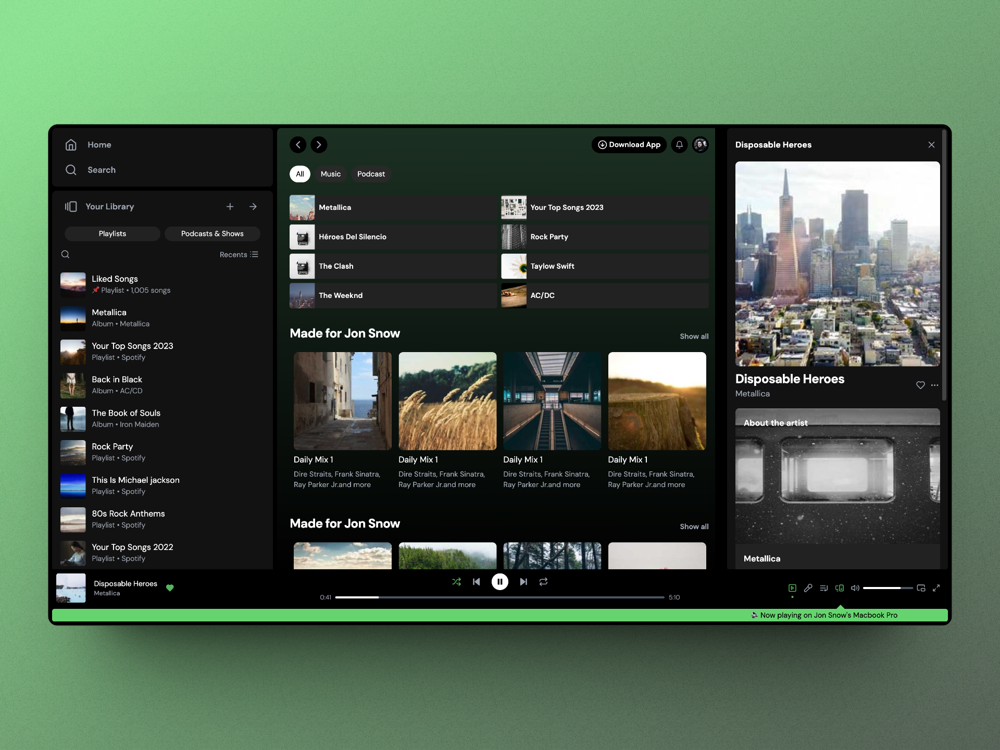
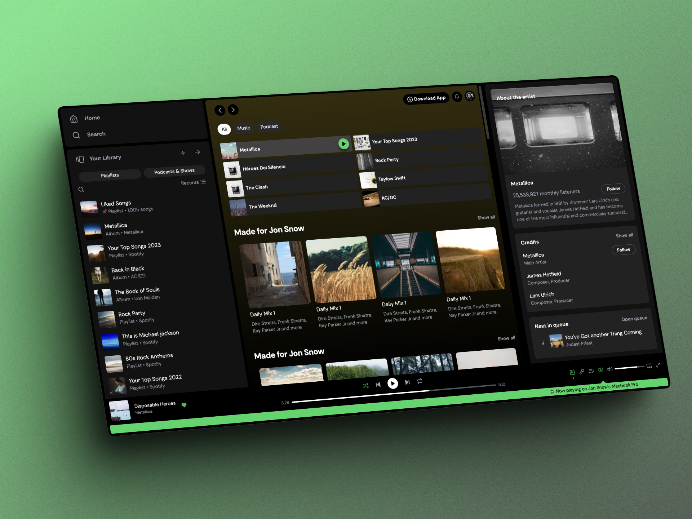
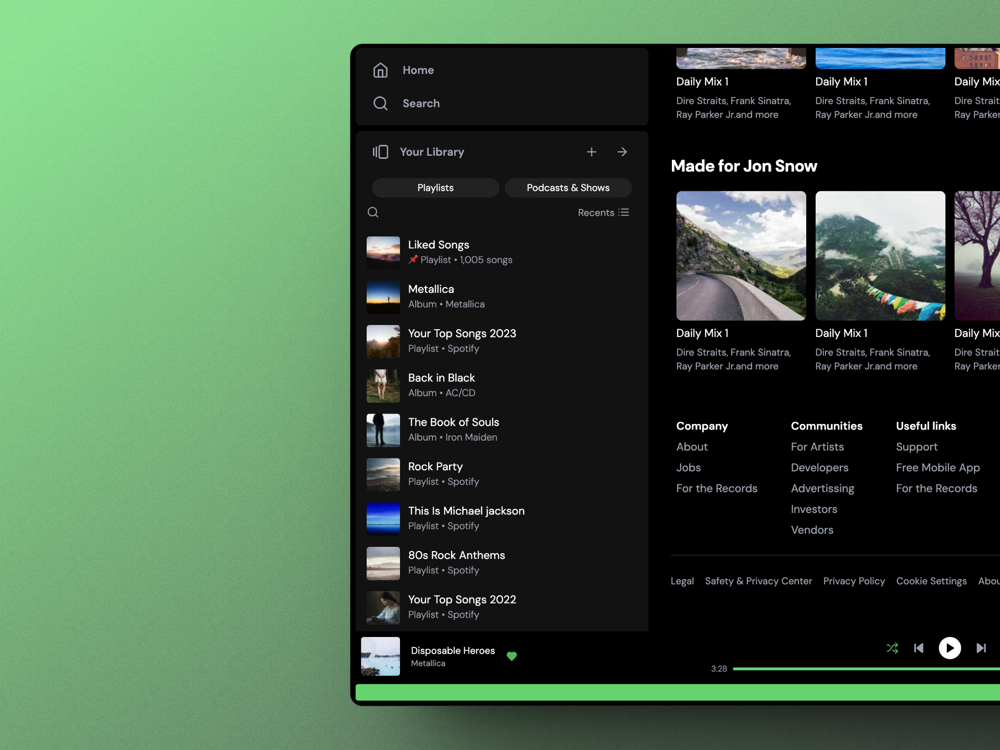
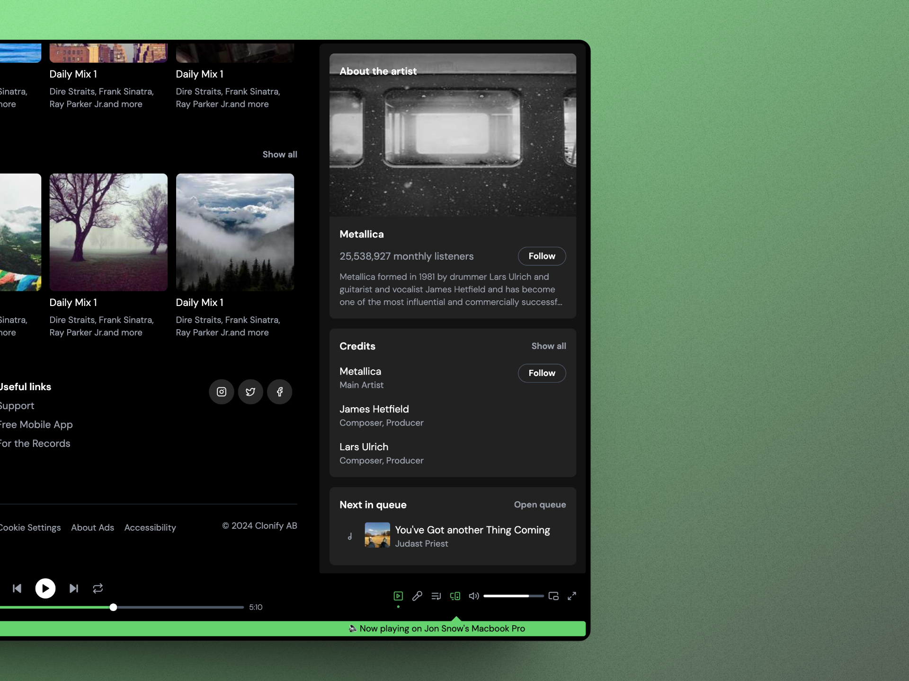

# Clone of Spotify Web App

> [!IMPORTANT]  
> **DISCLAIMER:** This project is for educational purposes only and is not intended to be a finished product or a template for other projects, but rather a case study aimed at better understanding the Spotify Web UI and practicing the use of Astro and TailwindCSS. I do not own the rights to any of the names, brands, artists, songs, albums, images, etc., that may be mentioned here.
 
## About

[**LIVE DEMO**](https://fv-spotify-study.netlify.app/)

**Spotify Web App Clone** created using [Astro](https://astro.build/) and [TailwindCSS](https://tailwindcss.com/). All images used are placeholders sourced from [Lorem Picsum
](https://picsum.photos/) to ensure no infringement of album copyrights.

Features implemented:
- [x] Home View
- [x] Song playbar progress

Future features:
- [ ] Hide Library Sidebar
- [ ] Search View
- [ ] Artist View
- [ ] Album/Playlist View
- [ ] Full screen
- [ ] Gradient Change

## Screenshots

